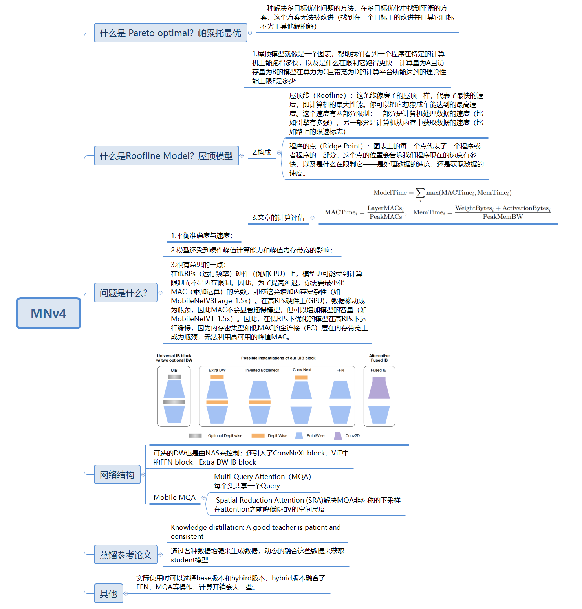

# 2024

## MobileNet V4

MobileNetV4 -- Universal Models for the Mobile Ecosystem

# 2023

## MobileOne

​		RELU激活函数时延最低，mobilenetv1的基础上引入了重参数化的思想。

## EfficientFormerV2

​		延迟与参数与MobileNetV2相近，但是准确度会高4%

## ConvNeXtV2

​		fully convolutional masked autoencoder, FCMAE—在图像上随机掩盖一些区域，让模型尝试恢复被掩盖的地方，使得模型学习到全局+局部的特征；

​		global response normalization, GRN—每个通道上对特征层进行归一化。

# 2022

## ConvNeXt

A ConvNet for the 2020s

​		实际使用的话慎重实验，工作量很大，也有很多trick的借鉴，但是很多没有说出原因，是否换个数据就无用了？

​		ViT中的QKV复杂度未HxW，对于较高分辨率的图像很难应用。包括后面的Swin Transformer引入的windows(在局部窗口进行attention)，行为上还是非常类似卷积。

​		训练技巧：引入Transformer中使用的训练技巧，由90改为300个epochs，AdamW优化器，Mixup，Cutmix，RandAugment，Random Erasing，Stochastic Depth，Label Smoothing；这些使用后使得性能提升了2.7%。

​		Stage Compute Ration：Swin Transformer中每个stage的比例大约是1:1:3:1，所以将ResNet每个stage的block改为(3,3,9,3)，原来是(3,4,6,3)；这些改变后网络从78.8%提升到79.4%。

​		Change stem to “Patchify”：紧跟着输入图像后面的层，下采样减少冗余信息。Swin中使用4x4的patch，文章采用相同思路使用4x4，stride=4的卷积(没有overlap区域)，提升了0.1%。

​		ResNeXt-ify：受ResNeXt启发，作者使用深度可分离卷积(分组数=通道数的分组卷积)。深度可分离卷积要么在空间维度上混合信息要么在通道维度上混合信息，无法两者同时进行。将网络宽度增加到与Swin-T相同的通道数（从64增加到96）。这使得网络性能提升至80.5%，同时FLOP数增加至5.3G。

​		Inverted Bottleneck：先膨胀再收缩的结构有利于MLP block的计算量(R50提升0.1%)。

​		Large Kernel Sizes：DW上移，在Swin中也是将多头注意力放在MLP之前。由于IB的存在同样能减少计算量。尝试了3,5,7,9,11等大小的卷积核，3x3的时候79.9%提升到7x7时的80.6%。

​		Micro Design：激活函数和norm层的选择。ReLU替换为GELU(Gaussian Error Linear Unit，ReLU更加平滑的变体)，但是并未有所提升。不同于以往一个卷积一个激活函数，在残差块中移除了GELU激活函数，**只在两个1x1之间保留一个**，结果提升到81.3%。**BN也仅在1x1卷积之前保留一个**，结果提升到81.4%，并且尝试在每个block开始前添加一个BN，这个方法未有提升。使用**LayerNorm替代BatchNorm**使得性能提升到81.5%。在每个stage开始时使用2x2conv stride=2进行空间下采样，这会导致训练不稳定；在分辨率发生变化的时候田间归一化层可以稳定训练，在每个下采样层之前、在stem之后以及在最终全局平均池化之后各添加一个准确率提升到82%。

## Swin Transformer V2

​		在V1的基础上使得模型可以更大，并且适配不同分辨率的图像和不同尺寸的window。

​		模型更大更深必定导致训练不稳定，因此剔除post-norm和cosine similarity。post-norm把Transformer block中的Layer Norm层从Attention层前面挪到后面，计算Attention之后会对输出进行归一化操作，稳定输出值；cosine similarity，之前QK计算attention是通过dot的方式，现在换成cosine，cosine自带normalization操作，进一步稳定Attention输出值。

​		模型不适配主要是图片分辨率和窗口大小的问题，在预训练过程中为了节约训练成本，采用的训练图片分辨率通常比较低(192/224)，但是很多下游任务要求的图片分辨率远大于训练分辨率的(1024/1536)，这就导致一个问题，将预训练模型迁移到下游任务时为了适配输入图片分辨率势必要改变窗口大小，改变窗口大小就会改变patch数量，改变patch数量就会导致相对位置编码偏置发生变化。当然可以简单的差值完成，但是效果必定不是最佳。V2提出Continuous relative position bias 和 Log-spaced coordinates。MLP来自适应生成相对位置偏置；相对位置编码从线性变化修改为对数变换，缩小编码的取值空间。

## VAN

 Large Kernel Attention：分为3个部分，常规DW卷积+带膨胀率的DW卷积+1x1卷积

# 2021

## Swin Transformer

​		Transformer从NLP领域迁移过来，和视觉领域存在差异。Shift windows结构的transformer来解决这些差异(1-视觉不同于文本，图像中的物体尺度变化很大，而NLP则不用考虑这个问题；2-相对于文本来说，图像分辨率高的话就有更多的像素，维度远大于文本，在计算自注意力时computational complexity是图像大小的平方)。

​		patch splitting module将图像分成不重叠的patches(token)，4x4的pacth，那么特征就有4x4x3=48；linear embedding将patch投射到维度C;

​		patch merging layers将所有的token合并来减少计算复杂度；第一个layer将附近2x2的patch进行concat成一组，再接线性层在这个4C的concat feature，输出为2C，相当于进行了降维；

​		Shifted Window在window内计算self-attention，减少了计算量。不仅改变windows的大小(相当于cross-windows)，还可以移动每个window的位置，引入相邻patch的信息，提高了model能力；

​		Attention Mask不同大小的window计算比较耗时，移位后每个2x2的windows分为4个区域，每个区域将他自己作为query和key扩展成4x1和1x4，再相乘，得到对应的attention mask，那样都是按照固定大小的window在计算。

## RepVGG

​		重参数的思想，“大而整”的运算效率由于“小而碎”；训练的时候模型结构是多分支为了更好的梯度流，而在部署的时候全部合成3x3单分支。

## TNT-Transformer in Transformer 

​		嵌套的Transformer，外transformer负责编码大小为16x16  patch之间的关系，内transformer负责编码大小为4 × 4 super-pixel之间的关系。

# 2020

## RegNet

​		NAS来搜索网络的最优结构。

​		模型最优深度20个blocka(60 layers)；bottleneck ration=1；每次下采样channel的宽度倍数width multiplier=2.5；卷积层输出tensor的大小与运算时间的相关性超过FLOPS；inverted bottleneck以及depthwise conv对性能是有害的；SE是有用的。

# 2019

## MobileNet V3

​		在V2的Inverted residual block结构中添加了SE模块(BNeck)，h-swish替代swish激活函数。

## EfficientNet

​		模型缩放方面的工作：深度（depth）增加或减少网络层的数量，宽度（width）增加或减少每层网络中通道（channel）的数量，分辨率（resolution）：增加或减少输入输出图像的尺寸。

# 2018

## MobileNet V2

​		v1局限：没有使用残差连接；很多depthwise卷积核训练出来是0(卷积kernels太单薄+ReLU导致)。ReLU会带来信息损耗，并未这种损耗无法恢复，当通道数很少的时候这就影响了模型性能(从信息流形分析了这个问题，还是比较能够说服)。

​		v2在v1的基础上先用1x1卷积升维(原来的6倍)，再降维(此处与ResNet不同，它是先降维再升维。并且shortcut连接的是两个低维的feature map，ResNet是连接两个高维)。

## CSPNet

​		浅层的feature map一份为2，一半经过后续block，另一半直接concat到block的输出中。

## SE-ResNet

Squeeze-and-Excitation Networks

​		残差块中添加了SE模块，附加了Channel-wise attention(也能很好理解，Squeeze先把特征图在空间维度HxW压缩到1，通过GAP完成；Excitation使用两个FC层，先降维再升维，通道之间建立相关性)。

## ShuffleNetV2

​		不再使用分组卷积，对于输入使用Channel Split(两种结构，采用split时，另一半直接堆叠，不用split时需过卷积)划分为2个部分，经过各自分支处理后concat到一起，对最终堆叠好的输出进行Channel Shuffle。

# 2017

## MobileNet V1

​		核心：深度可分离卷积。75的参数在1x1卷积中，可以使用im2col的方式进行加速(GEMM)。本身模型很小，参数量很少，一些正则的惩罚项可以不用，也不用担心过拟合的问题。输入图像到最终经过了5次下采样，缩小2^5=32倍。

## ResNeXt

​		split-transform-merge的思想，注意Cardinality(transform集合的数量，并且采用的是group conv，比如C=32，那么卷积分为32组)。

## ShuffleNetV1

​		对不同的channels进行shuffle来解决group conv的缺点。channel shuffle 实现过程：假设将输入层分为g个group，总通道数为gxn，首先 reshape 为 (g, n) 两个维度，然后转置为 (n, g)，最后 reshape 为一个维度。

# 2016

## ResNet

​		解决网络层数深了之后引发的梯度消失问题。网络设计为H(x)=F(x)+x，恒等映射作为网络的一部分(哪怕再深的网络只要F(x)=0那么网络的恒等映射也能保持性能)，那么学习目标可以转换为F(x)=H(x)-x。残差本来的意思就是观测值与估计值之间的差值，H(x)是观测值，x是估计值(上一层的输出)。

# 2014

## VGG

​		使用连续的几个3x3的卷积来代替AlexNet的大卷积核(11x11、7x7、5x5)。

# 2012

## AlexNet

