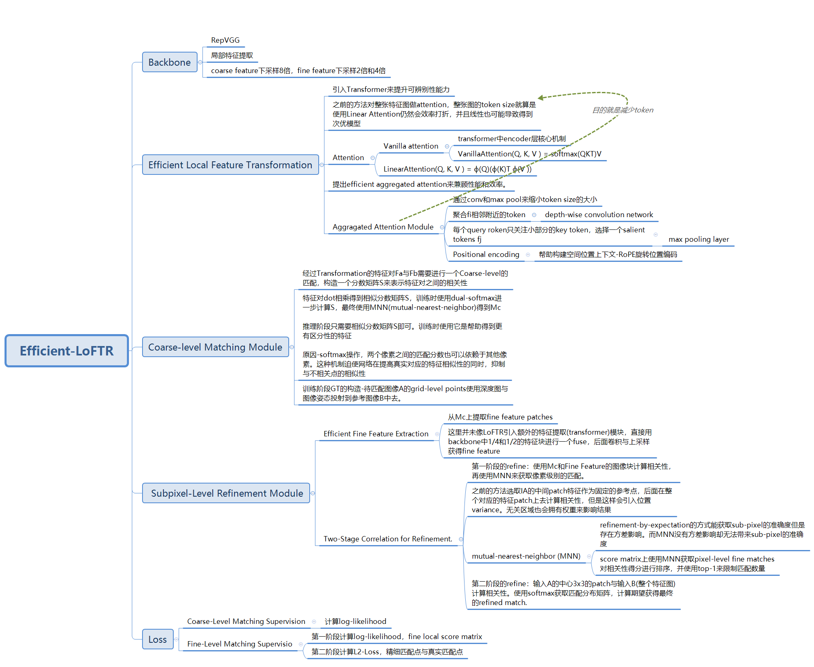

什么是稠密匹配？

​		稠密匹配是指在整张图像上匹配特征点,即匹配所有像素点或每个像素块,以获得更准确的匹配结果。

# detector-free

1. LoFTR

2. Efficient LoFTR: Semi-Dense Local Feature Matching with Sparse-Like Speed

   

# detector-base

1. SuperGlue

2. LightGlue