# 分割常用指标评价

令 i 为要预测的类别，j为其他类别

n_ii 为类别 i 被预测为类别 i 的像素数量，指 True Positive

n_ij 为类别 i 被预测为类别 j 的像素数量，指 False Negative

n_ji 为类别 j 被预测为类别 i的像素数量，指 False Positive

n_cl 为所有的类别总数 (分类+背景)

t_i 是指所有 n_ij 的总数+ n_ii 的总数，也就是真正的类别 i 的总像素数量

Pixel accuracy： 预测正确像素数量占类别i总像素数量的比例

mean accuracy：基于Pixel accuracy 所改进的指标，先计算每个类别的预测准确率再求平均

mean IU (mIOU)：计算所有像素类别的平均IOU

frequency weighted IU：基于mIOU所改进的指标，会依据每个类别出现的频率设置权重

# 2023

## VPD

Unleashing Text-to-Image Diffusion Models for Visual Perception

## SAN

Side Adapter Network for Open-Vocabulary Semantic Segmentation

# 这两篇文章需要了解Diffusion和CLIP

# 2022

## Mask2Former

Masked-attention Mask Transformer for Universal Image Segmentation

## PIDNet

PIDNet: A Real-time Semantic Segmentation Network Inspired by PID Controllers

​		高分辨率的细节与低分辨率的语义融合，会被四周的上下文信息“淹没”(overshoot 即超调，是控制系统中一种普遍的现象，指的是系统在达到稳态之前或之后，输出变量会超过其最终稳态值的情况；当反馈信号与期望值不同时，PID 控制器会根据比例、积分、微分三个部分计算出一个控制量来调整输出，从而使反馈信号逐渐接近期望值。但是在比例系数过大或系统响应过快时，控制器可能会产生超调现象，使得输出超过期望值一段时间，这可能导致系统出现震荡、不稳定等问题)。

​		核心在于依据PID的思想添加了一个分支，文章中有3个分支，前面两个不变，第3个boundary attention分支会引导前面两个分支的特征融合。具体做法有点类似STDC，这里采用的canny来给一个边界的先验给网路。

## DDRNet

Deep Dual-resolution Networks for Real-time and Accurate Semantic Segmentation of Road Scenes

​		双分辨率路径，一个分辨率保持下采样8倍，一个分辨率最小到下采样16倍，最终下采样16的特征图经过DAPPM(不同size的卷积核和stride通过1*1卷积和upsample再拼接到一起)进行融合。

# 2021

## BiSeNetV2

BiSeNet V2: Bilateral Network with Guided Aggregation for Real-time Semantic Segmentation

​		在V1的基础上做出的优化，主要框架包含2个分支。1个细节分支，宽通道浅层来捕捉low-level但高分辨率的特征，1个语义分支，通道窄但深层来获取high-level的特征。对于2个分支的特征融合也做出了优化。训练的时候在不同尺度插入辅助的分割头来强化训练。

## STDC

Rethinking BiSeNet For Real-time Semantic Segmentation

​		主要目的还是做轻量化的语义分割，并且在BiseNetV1的基础上做出优化改进。文章中的Detailed Guidance比较有意思，之前BiseNet使用CNN构造spatial path来学习边缘等low-level的信息；作者在GT的基础上使用Laplacian conv生成Detail GT，那么在分辨率还比较大的stage3加入一个Detail Head来学习low-level特征。

​		Detail GT其实是一个二值图，其pixel的数量将大大减少，那么导致类别不平衡，采用dice loss度量重合率(dice loss 比较适用于样本极度不均的情况，一般的情况下，使用 dice loss 会对反向传播造成不利的影响，容易使训练变得不稳定.)。在test阶段可以移除这个Detail Head，说白了就是给网络更好更明确的先验知识。这种辅助思想倒是可以借鉴到一些任务重。

## SETR

Rethinking Semantic Segmentation from a Sequence-to-Sequence Perspective with Transformers

​		目的还是在于怎么获取长距离依赖信息。将Transformer替代以往encoder-decoder结构中的编码器，基本还是与ViT很相似。

## DPT

Vision Transformers for Dense Prediction

​		编码-解码的结构存在一个问题：编码阶段丢失的信息很难在解码阶段恢复回来，因此在比较深的层必定会丢失一些信息。和SETR有些类似，使用Transformer来替代编码器。

## Segmenter

Segmenter: Transformer for Semantic Segmentation

​		同样是Transformer替代编码层，与上面两个文章的区别在于decoder的方式不同。

## SegFormer

SegFormer: Simple and Efficient Design for Semantic Segmentation with Transformers

​		Encoder被Transformer替代，Decoder使用FC。

## K-Net

K-Net: Towards Unified Image Segmentation

## MaskFormer

Per-Pixel Classification is Not All You Need for Semantic Segmentation

# 先看DETR，再来理解KNet及后面的文章Transformer、DETR、MaskFormer、Mask2Former

​		

# 2020

## OCRNet

Segmentation Transformer: Object-Contextual Representations for Semantic Segmentation

​		核心思想在于建立object于pixel的联系，分割任务其实是对像素进行分类，最终预测出对应的object，那么单个pixel和整个object必然是存在隐式的联系。

​		网络中间层的特征表示估计一个粗略的语义分割结果，称之为Soft Object Regions；利用网络深层特征Pixel Representations与SOE计算物体区域特征表示Object Region Representations；最终PR与ORE之间得到关系矩阵Pixel-Region Relation，PRR与ORE相乘得到最终的Object Contextual Representation。

## DNLNet

Disentangled Non-Local Neural Networks

​		有点难懂，主要分析了non-local机制，认为可以分解为pairwise term(像素之间的关系)和uanry term(像素本身的重要性)。

## PointRend

PointRend: Image Segmentation as Rendering

​		语义分割的后处理理解为计算机图形学的渲染问题。提升语义分割在物体边缘的性能并且控制运算量。首先输出一个低分辨率的分割图，再逐步上采样，在上采样的过程中对边缘进行处理。

​		对于实时性要求高的可以不用考虑这篇文章，上采样本身就很耗时，但是对于一些像素级别准确度的要求倒是可以考虑，在实际应用时亚像素级别可能还需要借助传统算法。

## CGNet

CGNet: A Light-weight Context Guided Network for Semantic Segmentation

​		分为4个部分：1.局部特征提取器(常规卷积实现)；2.context特征提取器(膨胀卷积实现)；3.联合特征提取器(局部和context进行concat)；4.全局特征提取器(concat之后的特征GAP+2个FC得到权重向量，这个作为attention map)。

# 2019

## APCNet

Adaptive Pyramid Context Network for Semantic Segmentation

​		仍然围绕上下文信息，作者目的在于找到最优的上下文向量，并且这个向量尽可能紧凑以减少无关信息的干扰。

​		核心点在于作者提出的ACM(Adaptive Contect Module)，ACM有两个分支，第一个分支学习Affinity亲和参数(理解为相关性)，第二个分支就是常规的adaptive average pooling操作，最终对两个分支的特征进行matrix product。

## DANet

Dual Attention Network for Scene Segmentation

​		使用双注意力网络来集成局部特征和全局依赖关系。以往的上下文融合的方法并没有从全局来考虑不同目标特征之间的关系。

​		核心在于提出的position attention和channel attention(每个高级特征的通道映射都可以看作是一个类特定的响应，不同的语义响应相互关联。通过挖掘通道映射之间的相互依赖性，强调相互依赖的特征映射，改善特定语义的特征表示)。

## Semantic FPN

Panoptic Feature Pyramid Networks

​		全局分割的概念：一张图中，有固定形态的物体认为是“thing”，使用instance segmentation割出来作为各类前景；对于无固定形态的物体认为是“stuff”，使用semantic segmentation割成各类背景。要实现全景分割，必须完成semantic / instance segmentation这两个任务。

​		将语义分割和实例分割的FCN和Mask R-CNN结合起来，设计了 Panoptic FPN。

## DMNet

Dynamic Multi-scale Filters for Semantic Segmentation

​		APCNet同一个作者，对结构做了一些改动(甚至图都是一样)。ACM变为DCM，同样的两个分支，只是第二个分支经过Adaptive pooling后再经过1*1卷积得到[K, K]大小的特征图，后面将这个作为卷积与第一个分支的输出进行深度可分离卷积的计算。

## CCNet

CCNet: Criss-Cross Attention for Semantic Segmentation

​		Non-Local需要的计算量太大，复杂度从(HxW)x(HxW)降为(HxW)x(H+W-1)。整幅图的attention变成了求十字路径的attention。

## EMANet

Expectation-Maximization Attention Networks for Semantic Segmentation

​		自注意力机制在分割中非常有帮助，但是计算量太大。作者提出EM算法来迭代一组紧凑的基，在这个基上使用注意力，从而减少计算量。

​		最主要的是这种思想：基当做参数，attention map当做隐变量；随机值作为初始的基，E步计算出隐变量的概率分布，M步通过隐变量的概率来迭代参数。

## ANN

Asymmetric Non-local Neural Networks for Semantic Segmentation

​		同样是从Non-Local计算量太大的角度出发，第一步**APNB** Asymmetric Pyramid Non-local Block减少self-attention时key和value的通道数，降低通道采用金字塔采样，对于输入的特征图使用pool得到4个尺度(1x1 3x3  6x6 8x8)，展平成1D再堆叠到一起；第二步**AFNB** Asymmetric Fusion Non-local Block利用高层特征H和低层特征L，L经过卷积得到K和V，H经过卷积得到Q，QK相乘再和V相乘起到特征融合的作用。

## GCNet

GCNet: Non-local Networks Meet Squeeze-Excitation Networks and Beyond

​		Non-Local对于不同的查询点起attention map是一样的，他的全局依赖是位置无关的(任务不一样。语义分割需要对每个像素都输出，所以要“雨露均沾”。分类只需关注最重要的概念就OK；而检测正例数量远远小于反例。只focus正例)。SENet则只考虑了通道间的依赖关系。结合二者使得model能够有长距离的长下文信息还能够比较轻量。

​		核心思想简化了non-local block，本身就是不受位置依赖，那么直接将key经过softmax加到value上。1x1卷积用bottleneck transform模块来取代，降低参数量。两层bottleneck transform增加了优化难度，在ReLU前面增加一个layer normalization层(降低优化难度且作为正则提高了泛化性)。

## FastFCN

FastFCN: Rethinking Dilated Convolution in the Backbone for Semantic Segmentation

​		空洞卷积能获得更大的感受野同时不减小特征图分辨率，提高语义分割精确度，但空洞卷积输出使得分辨率变大，增加了计算开销。作者提出了Joint Pyramid Upsampling(JPU) 来提取高分辨率特征图。

## Fast-SCNN(实时性友好)

Fast-SCNN for Semantic Segmentation

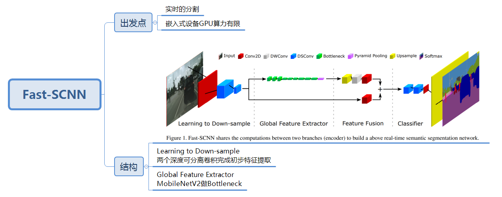

## ISANet

Interlaced Sparse Self-Attention for Semantic Segmentation

​		稀疏交错的自注意力机制(将密集的affinity matrix分解为两个稀疏矩阵的product)，通过两个注意力机制实现，一个捕捉长距离，一个捕捉短距离。

​		常规的self-attention给定一个大小为NxN的图，其计算复杂度为N^2。作者通过对输入图像打乱像素之间的排序，再从每一个小的patch内计算SA。

​		通过大量permute来建立稀疏连接，在实际工程应用不一定会很快。

# 2018

## BiSeNetV1

BiSeNet: Bilateral Segmentation Network for Real-time Semantic Segmentation

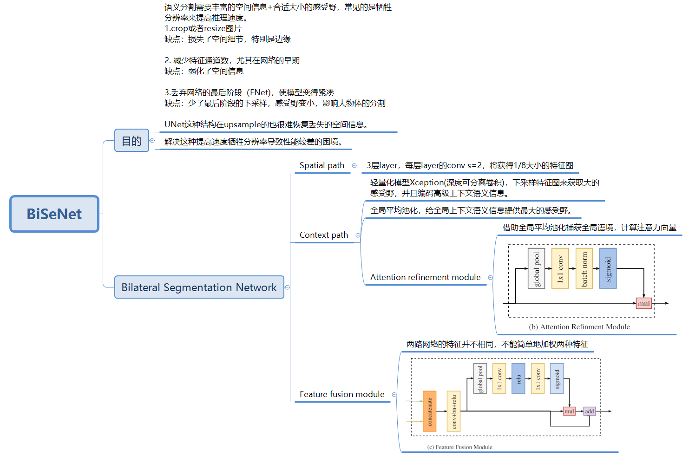

## PSANet

PSANet: Point-wise Spatial Attention Network for Scene Parsing

有一种空间KxL和通道(2H-1)x(2W-1)注意力的目的。

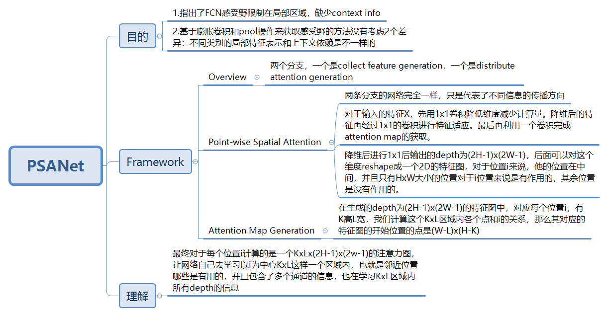

## ICNet

ICNet for Real-Time Semantic Segmentation on High-Resolution Images

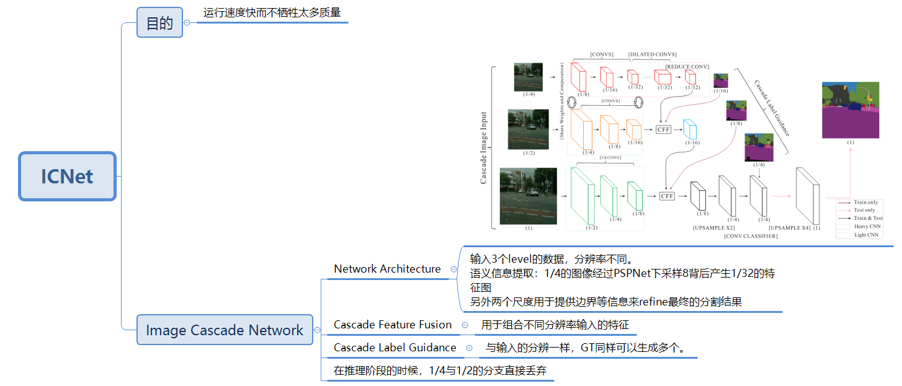

## UPerNet

Unified Perceptual Parsing for Scene Understanding

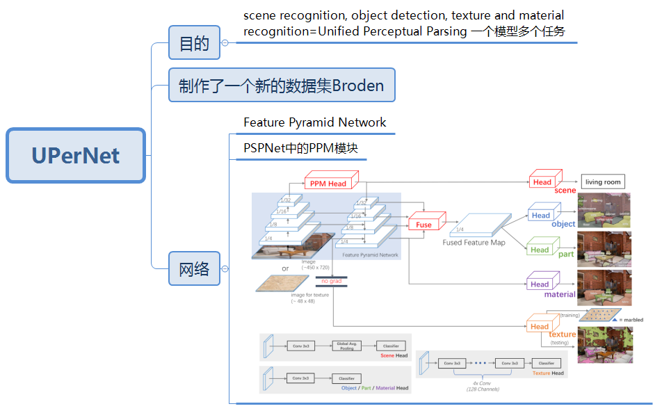

## DeepLabV3+

Encoder-Decoder with Atrous Separable Convolution for Semantic Image Segmentation

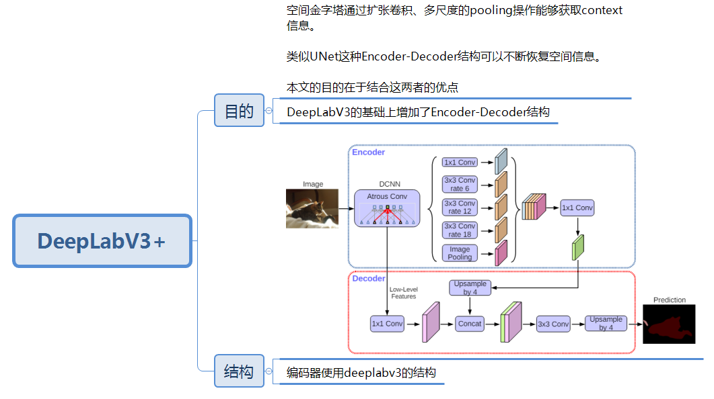

## EncNet

Context Encoding for Semantic Segmentation

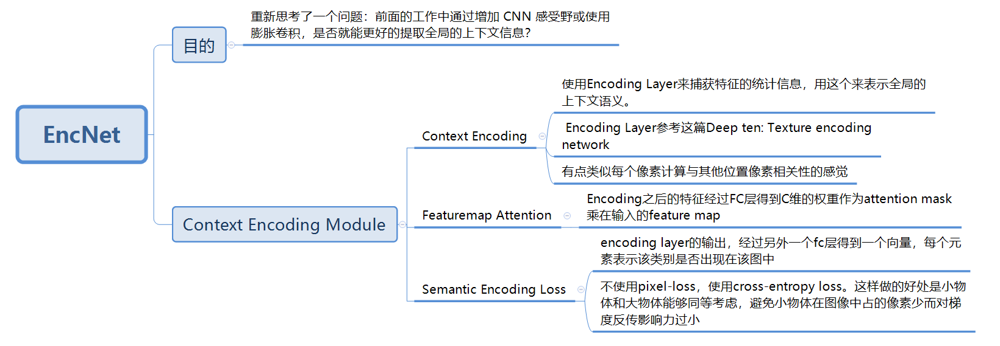

## Non-Local Net

Non-local Neural Networks

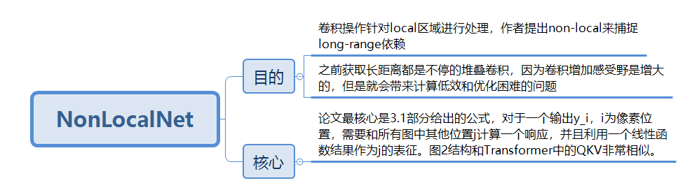

# 2017

## ERFNet

ERFNet: Efficient Residual Factorized ConvNet for Real-time Semantic Segmentation

空间可分离卷积

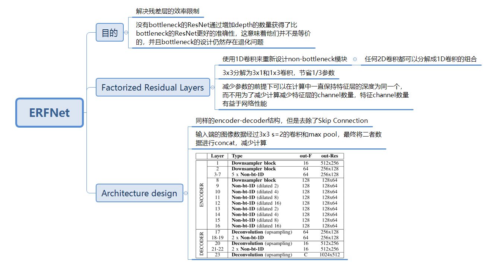

## PSPNet

Pyramid Scene Parsing Network

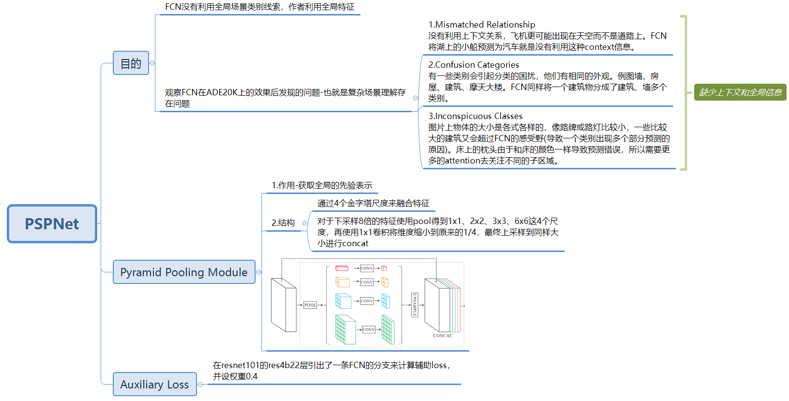

## DeepLabV3

Rethinking Atrous Convolution for Semantic Image Segmentation

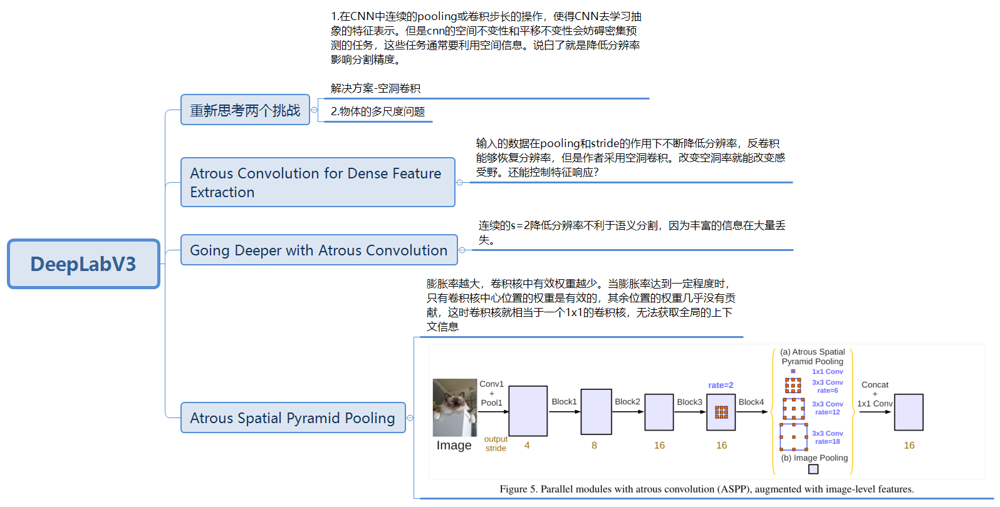

# 2016

## UNet

U-Net: Convolutional Networks for Biomedical Image Segmentation

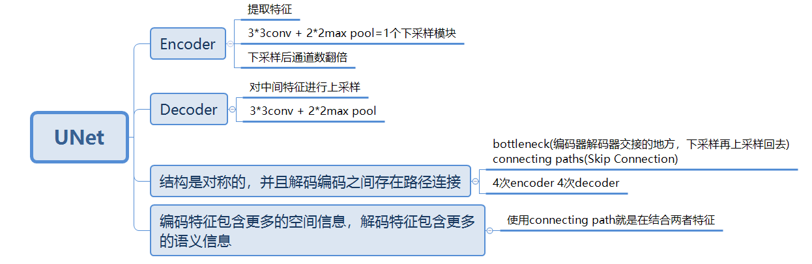

相关部署仓库-https://github.com/cagery/unet-onnx

# 2015

## FCN

Fully Convolutional Networks for Semantic Segmentation

​		使用转置卷积(双线性插值核)来替代全连接层。暴力的上采样必定丢失较多细节，而且在对各个像素进行分类时，没有考虑像素与像素之间的关系。
