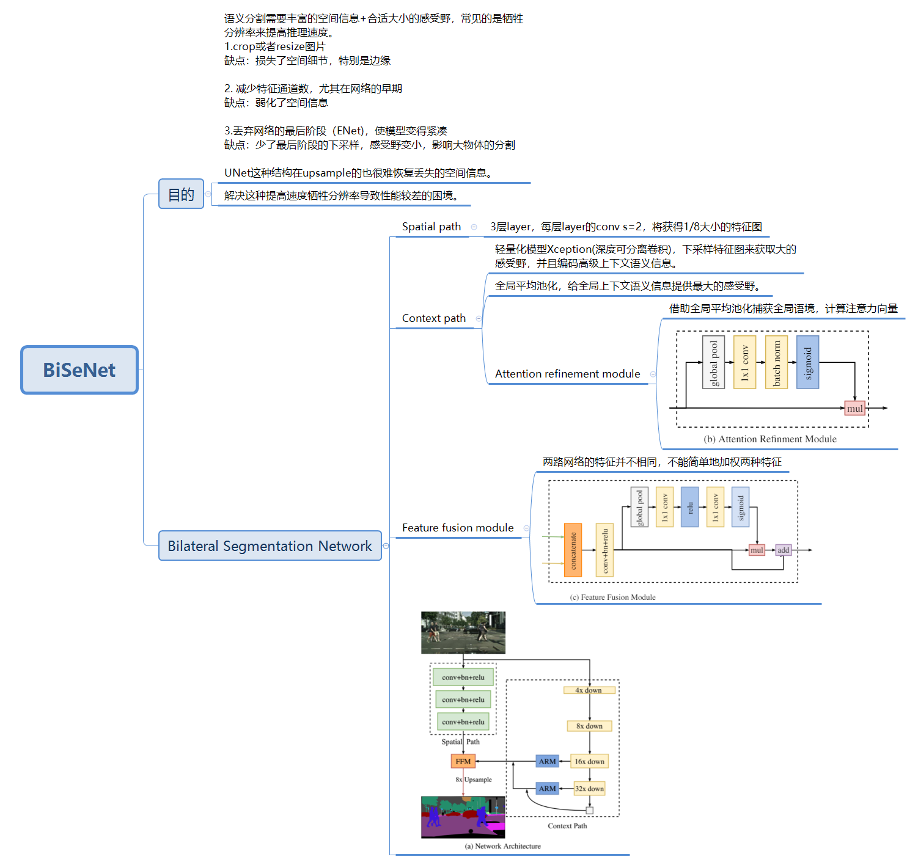

# 分割常用指标评价

令 i 为要预测的类别，j为其他类别

n_ii 为类别 i 被预测为类别 i 的像素数量，指 True Positive

n_ij 为类别 i 被预测为类别 j 的像素数量，指 False Negative

n_ji 为类别 j 被预测为类别 i的像素数量，指 False Positive

n_cl 为所有的类别总数 (分类+背景)

t_i 是指所有 n_ij 的总数+ n_ii 的总数，也就是真正的类别 i 的总像素数量

Pixel accuracy： 预测正确像素数量占类别i总像素数量的比例

mean accuracy：基于Pixel accuracy 所改进的指标，先计算每个类别的预测准确率再求平均

mean IU (mIOU)：计算所有像素类别的平均IOU

frequency weighted IU：基于mIOU所改进的指标，会依据每个类别出现的频率设置权重

# 2018

## BiSeNetV1

BiSeNet: Bilateral Segmentation Network for Real-time Semantic Segmentation

## PSANet

PSANet: Point-wise Spatial Attention Network for Scene Parsing

有一种空间KxL和通道(2H-1)x(2W-1)注意力的目的。

## ICNet

ICNet for Real-Time Semantic Segmentation on High-Resolution Images

## UPerNet

Unified Perceptual Parsing for Scene Understanding

## DeepLabV3+

Encoder-Decoder with Atrous Separable Convolution for Semantic Image Segmentation

## EncNet

Context Encoding for Semantic Segmentation

# 2017

## ERFNet

ERFNet: Efficient Residual Factorized ConvNet for Real-time Semantic Segmentation

空间可分离卷积

## PSPNet

Pyramid Scene Parsing Network

## DeepLabV3

Rethinking Atrous Convolution for Semantic Image Segmentation

# 2016

## UNet

U-Net: Convolutional Networks for Biomedical Image Segmentation

相关部署仓库-https://github.com/cagery/unet-onnx

# 2015

## FCN

Fully Convolutional Networks for Semantic Segmentation

​		使用转置卷积(双线性插值核)来替代全连接层。暴力的上采样必定丢失较多细节，而且在对各个像素进行分类时，没有考虑像素与像素之间的关系。
