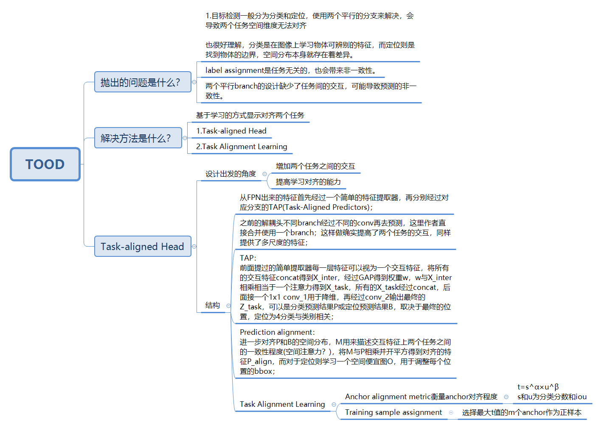

# 2024

## YOLOV10

backbone中加入SCDown模块，两个连续的卷积，第二个为深度可分离卷积；SPPF之后加入PSA，特征分组，不同组用不同大小kernel，结果拼接后再使用SE来学习每个通道的权重；

​		一致双分配策略（Consistent Dual Assignments）：

双标签分配（Dual Label Assignments）

​		一对多分配：在训练期间，多个预测框被分配给一个真实物体标签。这种策略提供了丰富的监督信号，优化效果更好。

​		一对一分配：仅一个预测框被分配给一个真实物体标签，避免了NMS，但由于监督信号较弱，容易导致收敛速度慢和性能欠佳。

​		双头架构：模型在训练期间使用两个预测头，一个使用一对多分配，另一个使用一对一分配。这样，模型可以在训练期间利用一对多分配的丰富监督信号，而在推理期间则使用一对一分配的预测结果，从而实现无NMS的高效推理

一致匹配度量（Consistent Matching Metric）

​		为了在训练期间保持两个预测头的一致性，研究提出了一致匹配度量。通过调整匹配度量参数，使得一对一和一对多分配的监督信号一致，减少了训练期间的监督差距，提升了模型的预测质量。

​		空间先验（s）指的是锚点与实际物体之间的关系，s表示预测的锚点是否位于目标实例内。间先验用于判断锚点是否合理地覆盖了物体。

​		如果一个（锚点）完全覆盖了一个（目标），那么空间先验s就为1，表示这个锚点有效。如果框架只部分覆盖或者完全不覆盖，s就会小于1，表示这个锚点不合适*

​		回归任务的目的基本相同，就算再多的正样本最终也只会分配到一个，因此只用考虑分类任务是否对齐。两个分支之间的监督差距可以通过不同分类目标的Wasserstein距离推导得出

# 2023

## YOLOV8

​		基于anchor point，每一个1x1的grid cell的中心作为一个anchor point；这里预测的是ltrb，也就是anchor point到gt box边界的上下左右；一直anchor point的坐标为(a_x, a_y)，那么xmin=(a_x - l) · s其他的也是类似，s是特征图相对于原图的缩放比例；

​		正样本匹配：根据gt信息获取xmin ymin xmax ymax；第二步骤粗筛，落在gtbox中的anchor point作为正样本(如果两个box覆盖了同一块anchor point？)；将3个层级的feature map上的anchor point映射回原图再进行第三步精筛，取出类别置信度^0.5xIOU^6作为align matrix，根据align matrix筛选出top10作为正样本；第四步考虑重叠后anchor point如何分配呢？那么anchor point预测的box与所有重叠的gtbox进行iou计算，anchor point只保留给最大iou的预测box

​		损失：定位损失CIOU+DFL和类别损失BCE，没有obj分支；分类损失先需要多所有类别各自进行一个二分类损失的计算，再与target做交叉熵损失(多分类只关注正确类别，二分类交叉熵可以抑制非真实的类别)；target score不是单独的one hot，而是align matrix的值，正因为不是one-hot的形式，两个score可以直接相除来求差距；

​		DFL损失：狄拉克分布，当x=0时为无穷，当x不等于0则为0；对于ltrb网络只会输出一个值，预测出的那个值概率为1；GFL对于ltrb会输出多个值，这多个值服从一般分布，每个值都有对应的概率；对于复杂场景存在边界模糊的情况，狄拉克分布就不太灵活，因此有了DFL的出现。回归一个分布对预测框进行建模，144=80+16x4，80个类别，对ltrb四个值都会预测出一个16维的离散分布向量，16个值的概率总和是1。物体边界清楚的时候分布是很尖锐锋利的，而模糊的情况有可能出现双峰的情况，那么能不能让模型来学习这种尖锐的分布呢？一个比较好的思路是提高真实值附近值的概率，那么分布就会快速聚拢，只用于正样本不用考虑正负样本不平衡的情况，那么直接使用交叉熵损失。-((y_i+1-y)log(S_i)+(y-y_i)log(Si+1))，互相用对方的距离作为权重来约束其实就是为了更快向中间聚拢。

# 2022

## YOLOV6

​		基本和YOLOX没啥区别，引入了Rep的思想，使得模型结构对推理时对硬件更加友好。

​		backbone和neck层面朝着Rep的思想去做，训练的时候设计不同的结构以便推理时使用单路的3x3Rep Conv，减小硬件上的延时和内存带宽利用率；

​		head在yolox的基础上去除了两个额外的3x3卷积层；

​		Label Assignment使用SimOTA与TAL。

​		Backbone：引入重参数技术，RepVGG，硬件友好；

​		Head：更高效的解耦头，减少硬件的额外开销；

​		simSPPF 参见v5中的修改的sppf 

# 2021

## YOLOX

​		Anchor-free的方式。

~~~python
"""
三个解耦头输出(假设输出尺度20*20 40*40 80*80)
cls 80dim数据集coco类别，reg 4dim回归坐标，obj 1dim前景背景  85dim
解耦头
	20*20*80	40*40*80	80*80*80
	20*20*4		40*40*4		80*80*4
	20*20*1		40*40*1		80*80*1
Concat
	20*20*85	40*40*85	80*80*85
	400*85		1600*85		6400*85

三个输出尺度Concat
	8400*85

Anchor-free未设置anchor box如何分配正样本
	使用下采样信息
	20*20下采样32倍，因此使用32*32的anchor box 400个
	40*40下采样16倍，因此使用16*16的anchor box 1600个
	80*80下采样8倍，因此使用8*8的anchor box 6400个

构造正样本anchor box

1.anchor box初步筛选，已知拥有8400个anchor box：
	a.根据GT box标注信息[x_center, y_center, width, height]，计算左上-右下位置		坐标[x1, y1, x2, y2]，计算每个anchor中心[x_center, y_center]，需满足：
	x_center - x1 > 0
	y_center - y1 > 0
	x2 - x_center > 0
	y2 - y_center > 0
	四个条件满足时可知anchor box的中心点位于GT box内
	
	b.以GT box中心为基准，构造5*5矩形，计算anchor box中心点落在矩形内的anchor box
	
2.精细筛选
	经过步骤1，假设得到1000个正样本anchor box，这些anchor box的位置与之前8400个位置一一对应，依据anchor box的位置信息获取预测信息：
	Reg [1000, 4]
	Obj [1000, 1]
	Cls [1000, 80]
	假设GT box为3，那么将1000预测框与3真实框计算IOU与Cls：
	iou = [gt_boxes, pred_boxes]
	iou_loss = -torch.log(iou + 1e-8)
	
	pred_cls = pred_obj * pred_cls
	cls_loss = binary_cross_entropu(pred_cls, gt_cls)
	维度为[3, 1000]
	
3.cost计算
	cost = cls_loss + 3 * iou_loss + 10000.0 * (~is_in_boxes_and_center)
	不在中心区域的box增加了cost，相当于过滤操作
	
4.SimOTA
	4.1 动态候选框数量
		新建全为0的matching_matrix，维度与cost一致[3, 1000]
		设置候选框数量为10
		从iou中取出值最大的前10个候选框[3, 10]，每个gt box对应10个候选框，iou从大到小
		axis=1上求和，得到该gt box10个候选框iou的总和[3, 1]
		
		假设为[3.67, 4.15, 3.55].T
		直接取整为[3, 4, 3].T
		因此可知3个gt box分别划分3、4、3个候选框
		matching_matrix依据cost与候选框数量将对应位置=1，其余=0
	4.2 过滤共用的候选框
		当出现1和2的gt box共用一个候选框，需要进行过滤
		axis=0上求和，得到[1000, 1]，当出现共用时，对应列数值>1
		取出>1对应列的数值，比较二者cost，大者置为0，丢弃该候选框
		

is_in_boxes_and_center是精细过滤的样本
is_in_box_anchor是初步筛选的样本

前者用于构造正样本anchor box，而最终计算loss使用初筛样本与构造的正样本anchor box
anchor用于构造正样本，Reg分支实际在预测这些正样本anchor box相对于GT box的偏移量
"""
~~~

# 2020

## YOLOV4

​		Label Assignment：3个尺度的特征图，每个尺度依据grid共有HxWx3个anchor box。Anchor box与目标框的IOU大于阈值，就作为正样本，其他为负样本，无忽略样本概念。

## YOLOV5

​		Label Assignment：不同于以往使用IOU的匹配方式，V5采用GT box与anchor的宽高比来分配：

​		1.抽取GT box的宽高，将宽高与anchor相除。只需要满足anchor与当前特征层中GT box的宽高比例在阈值范围内，太大表示当前特征图无anchor能够很好的表征GT box，这一步完成不同尺度的特征层处理不同大小的物体；

 		2.满足条件1，取GT box的xy(中心点)，一个block区域分为四个象限，左上，右上，左下，右下，判断xy落在哪个象限内，最后通过offset来扩张，将1个grid扩张到3个grid。

​		SPPF将3个5x5的maxpool串联起来，2个5x5相当于一个9x9，每个再去concat；之前SPP是5 9 13三个不同大小核做maxpool，计算量减小；

​		损失只要有三个classes loss，objectness loss(注意与其他的区别，一般而言代表的是这个box是否有目标，而v5中是iou的值)，location loss；

​		网络有多个输出头，对于不同尺度的obj损失也有超参数调整；

​		越深层，感受野越大，对小目标不敏感，并且小细节丢失的太多；

​		grid预测(V3-V5的变化)：首先判断gtbox的中心点落在哪个grid cell中。sigmoid(t_x)+c_x，预测的是相对于左上角的偏移，使用sigmoid那么与左上角的偏移和可能t_x会趋向于正无穷和负无穷值域在0-1之间。V4使用(2xsigmoid(t_x)-0.5)+c_x，这个函数的取值范围在-0.5-+1.5之间，那么网络很容易得到0-1，而不用去预测一个正无穷负无穷的值。V5除了有这个修改还对宽高做出修改，之前的b_w=p_w e^t修改为b_w=p_w(2xsigmod(t_w))^2，当t很大时，e^t就会指数爆炸，修改后缩小了值域0-4之间。c_x是左上角角点的坐标，p_w是gtbox的宽。

​		anchor匹配：iou修改为gt和anchor两个box的宽高比例；阈值设为4是因为限定了值域在0-4之间。包括后续扩充到3个box也是因为值域变为了-0.5-1.5

# 2019

## YOLACT

​		yolo系列用于seg任务的思想源于该篇文章。

BlendMask

SOLO

# IOU系列

​		iou：交并比，当pred_box与gt_box不相交时，iou=0无法反应两个box的距离，函数不可导；另一种情况是两组不同大小的box重叠，但是iou可能相同。

​		giou：增加了相交尺度的衡量，两个box的最小外接矩形为C，并集为B，那么差集=C-B，giou loss=1-(iou-差集/C)；同样存在问题，当预测框出现在GT框内部时差集为0，退化成iou。

​		diou：从重叠面积+两个box的中心点距离+长宽比来考虑，最小外接矩形的对角线距离为C，中心点距离为B，那么diou loss = 1-(iou-B/C)；同样存在问题，没有考虑长宽比，只要框的中心位置相对box未变，B/C其实是一样的。

​		ciou：考虑了长宽比，在diou的基础上添加了衡量长宽比一致性的参数。

​		eiou：将原始的宽高比例，改为宽高值回归。

​		siou：考虑了box之间的向量角度。目标检测的一开始的训练中，大部分预测框是跟真实框不相交的，如何快速的收敛两框之间的距离是值得考虑的。

# BBox的编码解码

​		一般而言，检测模型在预测anchor box和gt box之间的offset。anchor box = [0.2, 0.5, 0.1, 0.2] ，gt box=[0.25, 0.55, 0.08, 0.25]，offset=[0.05, 0.05, -0.02, 0.05]。

BBox的编码表示：

​		1.中心表示—xy表示box的中心，wh表示box的宽高；

​		2.角点表示—x1y1左下，x2y2右上；

​		3.MinMax表示—与交点类似，只不过表示的xy的最大最小；

BBox的解码表示：

​		1.中心表示解码—gt box=[x_gt, y_gt, w_gt, h_gt] ，anchor box=[x_anchor, y_anchor, w_anchor, h_anchor]，那么x_decode=(x_gt-x_anchor)/w_anchor，w_decode=ln(w_gt/w_anchor)；

​		2.角点表示解码—和1类似，只不过是不用回归wh；

​		3.与2一样；

# Loss

## Focal Loss

Focal Loss for Dense Object Detection

​		解决的是 easy samples dominant (困难样本挖掘)的问题，并不是class imbalance( easy sample 和 hard sample 的 imbalance 问题，而不是 Positive class 和 Negative class 的 imbalance 问题)。

​		通过γ来控制交叉熵的权重，当预测的概率P越大那么(1-P)越小，γ作为它的幂进一步减小它的权重，使得网络更加注重hard sample的优化。γ论文中取2效果最佳。

## Quality Focal Loss

Qualified and Distributed Bounding Boxes for Dense Object Detection

​		IOU Score与CLS Score结合，相当于做了一个标签平滑，更加soft。Focal Loss中的Label是0 1，而这里经过soft为小数。

## Varifocal Loss

VarifocalNet: An IoU-aware Dense Object Detector

​		Focal Loss优化难分样本时，正负样本同等看待。对于负样本完全没必要花太多的时间，VFL通过判断预测box和gt box的IOU是否为0降Loss扩展为大于0和小于0的情况，只在负样本的时候使用γ来减少损失的贡献。

# Label Assignment

## TOOD

TOOD: Task-aligned One-stage Object Detection

